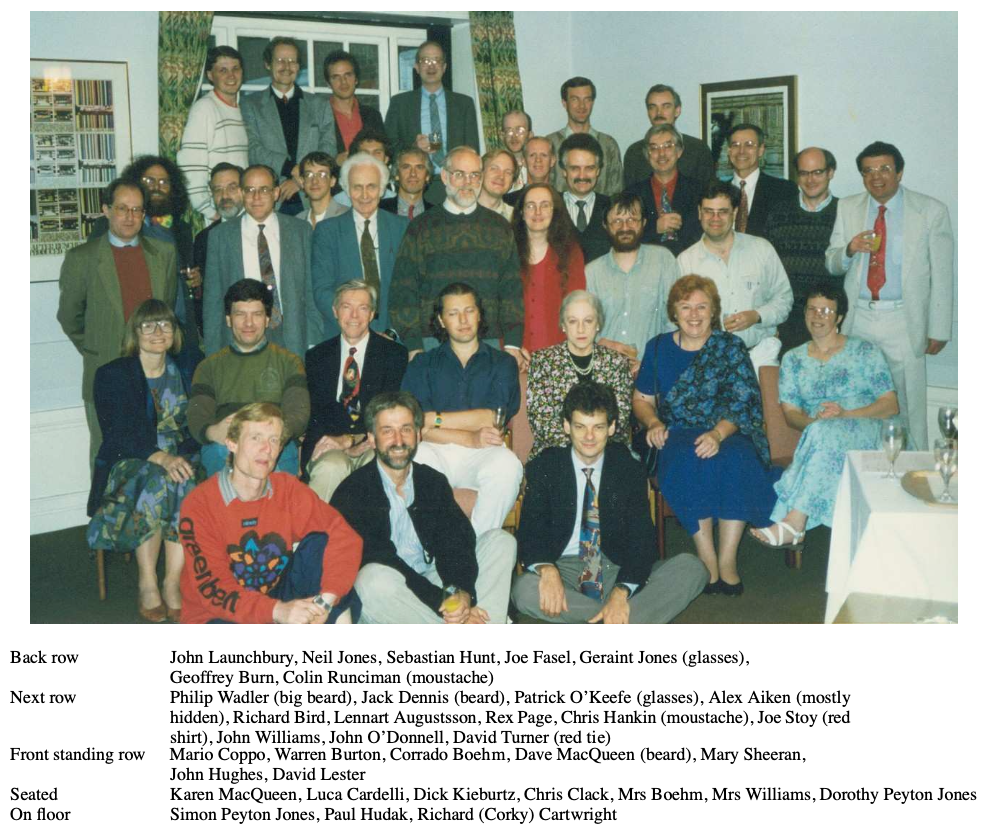
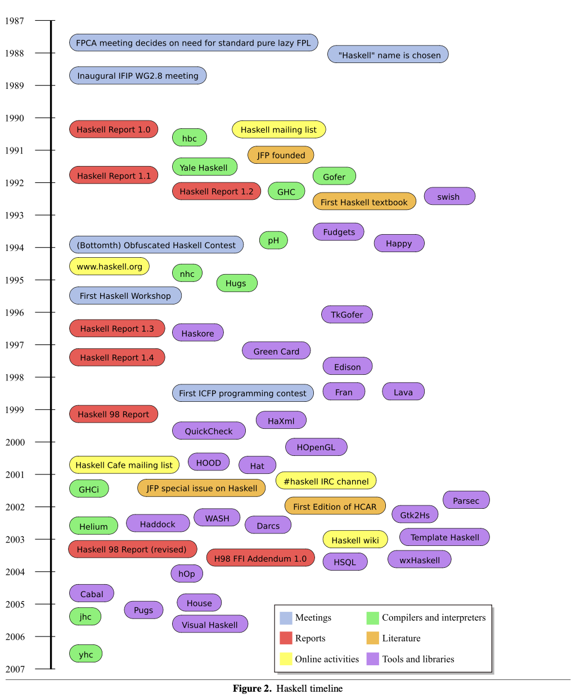

> 2 . The genesis of Haskell

## 2 Haskell 的起源

> In 1978 John Backus delivered his Turing Award lecture, “Can programming be liberated from the von Neumann style?” (Backus, 1978a), which positioned functional programming as a radical attack on the whole programming enterprise, from hardware architecture upwards. This prominent endorsement from a giant in the field—Backus led the team that developed Fortran, and invented Backus Naur Form (BNF)—put functional programming on the map in a new way, as a practical programming tool rather than a mathematical curiosity.

1978年，John Backus 发表了题为 “Can programming be liberated from the von Neumann style?”（《编程能从冯诺依曼风格中解脱吗？》）的图灵奖获奖演讲（Backus， 1978a），此举令函数式编程从硬件架构底层往上彻底击翻整个编程领域。这份来自业界巨匠（Backus 领导了开发 Fortran 语言的团队，并发明了巴科斯-诺尔范式（BNF））的突出认可使函数式编程从一种数学奇思妙想转变为一种实用的编程工具，并借此坐稳了业界地位。

> Even at that stage, functional programming languages had a long history, beginning with John McCarthy’s invention of Lisp in the late 1950s (McCarthy, 1960). In the 1960s, Peter Landin and Christopher Strachey identified the fundamental importance of the **lambda calculus** for modelling programming languages and laid the foundations of both operational semantics, through abstract machines (Landin, 1964), and denotational semantics (Strachey, 1964). A few years later Strachey’s collaboration with Dana Scott put denotational semantics on firm mathematical foundations underpinned by Scott’s domain theory (Scott and Strachey, 1971; Scott, 1976). In the early ’70s, Rod Burstall and John Darlington were doing program transformation in a first-order functional language with function definition by **pattern matching** (Burstall and Darlington, 1977). Over the same period David Turner, a former student of Strachey, developed SASL (Turner, 1976), a **pure higher-order** functional language with lexically scoped variables— a sugared lambda calculus derived from the applicative subset of Landin’s ISWIM (Landin, 1966)—that incorporated Burstall and Darlington’s ideas on **pattern matching** into an executable programming language.

即便在那之前，函数式编程语言已经发展了很长时间了，最早要从 50 年代末 John McCarthy 发明的 Lisp 开始算起（McCarthy，1960）。60 年代 Peter Landin 和 Christopher Strachey 认识到 **Lambda 演算** (lambda calculus) 在编程语言建模方面的重要性，并分别通过抽象机的操作语义（Landin，1964）和指称语义（Strachey，1964）为其奠定了基础。几年后，Strachey 与 Dana Scott 合作，利用 Scott 域理论（Scott 和 Strachey，1971；Scott，1976）为指称语义提供了坚实的数学基础。70 年代早期，Rod Burstall 和 John Darlington 实现用一种支持 **模式匹配** 进行函数定义的一阶函数式语言完成程序变换（Burstall 和 Darlington，1977）。同期，David Turner (Strachey 的学生) 开发了 SASL (Turner，1976)，即一种 **纯的高阶（pure higher-order）** 函数式语言，其采用了词法作用域变量（lexically scoped variables），它本质上是对 Landin 的 ISWIM 语言 (Landin, 1966) 的应用子集进行语法糖化的 **Lambda 演算** ，还将 Burstall 和 Darlington 的 **模式匹配** 概念融入到这个可执行的编程语言中。

> In the late ’70s, Gerry Sussman and Guy Steele developed Scheme, a dialect of Lisp that adhered more closely to the **lambda calculus** by implementing lexical scoping (Sussman and Steele, 1975; Steele, 1978). At more or less the same time, Robin Milner invented ML as a meta-language for the theorem prover LCF at Edinburgh (Gordon et al., 1979). Milner’s **polymorphic type system** for ML would prove to be particularly influential (Milner, 1978; Damas and Milner, 1982). Both Scheme and ML were strict (call-by-value) languages and, although they contained imperative features, they did much to promote the functional programming style and in particular the use of **higher-order** functions.

70 年代后期，Gerry Sussman 和 Guy Steele 联合开发了 Scheme 语言，这是 Lisp 的一种方言，借助词法作用域（lexical scoping）的实现做到更加贴近真正的 **Lambda 演算**（Sussman 和 Steele，1975；Steele，1978）。差不多同一时期，Robin Milner 在爱丁堡大学发明了 ML 语言，用作定理证明器 LCF[^lcf] 的元语言 (Gordon et al.，1979)。Milner 为 ML 设计的 **多态类型系统** 后来被证明具有重大影响 (Milner，1978；Damas 和 Milner，1982)。Scheme 和 ML 都是 *严格求值* 的语言 (call-by-value)，尽管它们也包含了一些命令式特性，但它们在很大程度上推广了函数式编程风格，特别是 **高阶函数** 的使用。

[^lcf]: <https://en.wikipedia.org/wiki/Logic_for_Computable_Functions>

> 2.1 The call of laziness

### 2.1 惰性调用

> Then, in the late ’70s and early ’80s, something new happened. A series of seminal publications ignited an explosion of interest in the idea of lazy (or non-strict, or call-by-need) functional languages as a vehicle for writing serious programs. **Lazy evaluation** appears to have been invented independently three times.

在 70 年代后期到 80 年代初期，函数式编程领域出现了新的突破。一系列开创性的出版物引发了人们对使用惰性（或非严格、按需调用）函数式语言来编写严肃程序的浓厚兴趣。此时，**惰性求值** 似乎被独立发明了三次。

> - Dan Friedman and David Wise (both at Indiana) published “Cons should not evaluate its arguments” (Friedman and Wise, 1976), which took on lazy evaluation from a Lisp perspective.

- Dan Friedman 和 David Wise（均在印第安纳大学）发表了论文“Cons shouldn't evaluate its arguments”（Friedman 和 Wise，1976 ）。他们从 Lisp 的角度探讨了惰性求值。

> - Peter Henderson (at Newcastle) and James H. Morris Jr. (at Xerox PARC) published “A lazy evaluator” (Henderson and Morris, 1976). They cite Vuillemin (Vuillemin, 1974) and Wadsworth (Wadsworth, 1971) as responsible for the origins of the idea, but popularised the idea in POPL and made one other important contribution, the name. They also used a variant of Lisp, and showed soundness of their evaluator with respect to a denotational semantics.

- Peter Henderson（纽卡斯尔大学）和 James H. Morris Jr.（施乐帕克研究中心）发表了论文“A lazy evaluator”（Henderson 和 Morris，1976 ）。他们引用了 Vuillemin (1974) 和 Wadsworth (1971) 的工作作为这个想法的起源，并在程序设计语言原理 (POPL) 会议上推广了这一概念。他们还做出了另一个重要贡献，即为这种求值策略命名为“惰性求值”。他们同样使用了一种 Lisp 方言，并证明了他们的求值器相对于指示语义是健全的 (soundness)。

> - David Turner (at St. Andrews and Kent) introduced a series of influential languages: SASL (St Andrews Static Language) (Turner, 1976), which was initially designed as a strict language in 1972 but became lazy in 1976, and KRC (Kent Recursive Calculator) (Turner, 1982). Turner showed the elegance of programming with lazy evaluation, and in particular the use of lazy lists to emulate many kinds of behaviours (Turner, 1981; Turner, 1982). SASL was even used at Burroughs to develop an entire operating system—almost certainly the first exercise of pure, lazy, functional programming “in the large”.

- David Turner（圣安德鲁斯大学和肯特大学）引入了一系列影响深远的语言：SASL（圣安德鲁斯静态语言）（Turner，1976 ），该语言最初在 1972 年被设计为严格求值的语言，但在 1976 年变成了惰性求值的语言；以及 KRC（肯特递归计算器）（Turner，1982 年）。Turner 展示了使用惰性求值进行编程的优雅之处，特别是使用惰性列表来模拟各种行为 (Turner, 1981; Turner, 1982)。SASL 甚至被 Burroughs 公司用于开发整个操作系统，这几乎可以肯定是最早的“大规模”纯惰性函数式编程实践案例。

> At the same time, there was a symbiotic effort on exciting new ways to implement lazy languages. In particular:

与此同时，那些令人兴奋的实现惰性语言的新方法也在携手奋进。尤其是：

> - In software, a variety of techniques based on graph reduction were being explored, and in particular Turner’s inspirationally elegant use of SK combinators (Turner, 1979b; Turner, 1979a). (Turner’s work was based on Haskell Curry’s combinatory calculus (Curry and Feys, 1958), a variable-less version of Alonzo Church’s lambda calculus (Church, 1941).)

- 在软件方面，研究人员正在探索各种基于图归约（graph reduction）的实现技术。尤其值得一提的是 David Turner 富有启发性和优雅的使用 SK 组合子（SK combinators）的方法（Turner，1979b；Turner，1979a）。（Turner 的工作是基于 Haskell Curry 的组合子演算 （Curry 和 Feys，1958），这是一种没有变量的 Alonzo Church 的 Lambda 演算（Church，1941）的变体。）

> - Another potent ingredient was the possibility that all this would lead to a radically different non-von Neumann hardware architectures. Several serious projects were underway (or were getting underway) to build dataflow and graph reduction machines of various sorts, including the Id project at MIT (Arvind and Nikhil, 1987), the Rediflow project at Utah (Keller et al., 1979), the SK combinator machine SKIM at Cambridge (Stoye et al., 1984), the Manchester dataflow machine (Watson and Gurd, 1982), the ALICE parallel reduction machine at Imperial (Darlington and Reeve, 1981), the Burroughs NORMA combinator machine (Scheevel, 1986), and the DDM dataflow machine at Utah (Davis, 1977). Much (but not all) of this architecturally oriented work turned out to be a dead end, when it was later discovered that good compilers for stock architecture could outperform specialised architecture. But at the time it was all radical and exciting.

- 另一方面，惰性求值语言有可能导致与冯·诺伊曼架构截然不同的硬件架构。当时正有几个严肃的项目正在进行（或即将启动），旨在构建各种数据流（dataflow）和图归约机器，例如麻省理工学院的 Id 项目 （Arvind 和 Nikhil，1987）、犹他大学的 Rediflow 项目 （Keller et al.，1979）、剑桥大学的 SK 组合子机器 SKIM （Stoye et al.，1984）、曼彻斯特数据流机器 （Watson 和 Gurd，1982）、伦敦帝国理工学院的 ALICE 并行归约机器 （Darlington 和 Reeve，1981）、Burroughs 公司的 NORMA 组合子机器 （Scheevel，1986） 以及犹他大学的 DDM 数据流机器 （Davis，1977）。后来人们发现，通用架构的优秀编译器可以超过专用架构的性能，因此这项以架构为导向的研究工作大部分 (并非全部) 被证明是死胡同。不过在当时，这些研究都是非常激进且令人兴奋的。

> Several significant meetings took place in the early ’80s that lent additional impetus to the field.

80 年代初期一些重要会议也在推动着函数式编程领域发展。

> In August 1980, the first Lisp conference took place in Stanford, California. Presentations included Rod Burstall, Dave MacQueen, and Don Sannella on Hope, the language that introduced **algebraic data types** (Burstall et al., 1980).

1980 年 8 月，加州斯坦福举办了第一届 Lisp 大会。会上，Rod Burstall、Dave MacQueen 和 Don Sannella 联合展示了 Hope 语言，该语言引入了 **代数数据类型** （Burstall et al.，1980）。

> In July 1981, Peter Henderson, John Darlington, and David Turner ran an Advanced Course on Functional Programming and its Applications, in Newcastle (Darlington et al., 1982). All the big names were there: attendees included Gerry Sussman, Gary Lindstrom, David Park, Manfred Broy, Joe Stoy, and Edsger Dijkstra. (Hughes and Peyton Jones attended as students.) Dijkstra was characteristically unimpressed—he wrote “On the whole I could not avoid some feelings of deep disappointment. I still believe that the topic deserves a much more adequate treatment; quite a lot we were exposed to was definitely not up to par.” (Dijkstra, 1981)—but for many attendees it was a watershed.

1981 年 7 月，Peter Henderson、John Darlington 和 David Turner 在纽卡斯尔举办了名为“函数式编程及其应用”的高级课程（Darlington et al.，1982）。该课程汇集了众多大咖，参会人员包括 Gerry Sussman、Gary Lindstrom、David Park、Manfred Broy、Joe Stoy 和 Edsger Dijkstra。（Hughes 和 Peyton Jones 以学生身份参会。）Dijkstra 对该领域并不感冒，他写道：“总的来说，我难掩深深的失望之情。我仍然认为这个主题应该得到更充分的对待；我们接触到的很多内容显然都不过如此。”（Dijkstra，1981） 但对于许多参会者来说，这次课程是分水岭式的体验。

> In September 1981, the first conference on Functional Programming Languages and Computer Architecture (FPCA)—note the title!—took place in Portsmouth, New Hampshire. Here Turner gave his influential paper on “The semantic elegance of applicative languages” (Turner, 1981). (Wadler also presented his first conference paper.) FPCA became a key biennial conference in the field.

1981 年 9 月，新罕布什尔州朴茨茅斯举办了第一届 **函数式编程语言和计算机体系结构** 会议（FPCA）（注意会议标题！）David Turner 在会上发表了影响深远的论文“应用型语言的语义优雅性” （Turner，1981）。（Wadler 也在此次会议上提交了他的第一篇会议论文。）FPCA 后来成为该领域的关键性两年一度的会议。

> In September 1982, the second Lisp conference, now renamed Lisp and Functional Programming (LFP), took place in Pittsburgh, Pennsylvania. Presentations included Peter Henderson on functional geometry (Henderson, 1982) and an invited talk by Turner on programming with infinite data structures. (It also saw the first published papers of Hudak, Hughes, and Peyton Jones.) Special guests at this conference included Church and Curry. The after-dinner talk was given by Barkley Rosser, and received two ovations in the middle, once when he presented the proof of Curry’s paradox, relating it to the Y combinator, and once when he presented a new proof of the Church-Rosser theorem. LFP became the other key biennial conference.

1982 年 9 月，宾夕法尼亚州匹兹堡举办了第二届 Lisp 大会，并更名为 Lisp 和函数式编程 (LFP)。会上，Peter Henderson 发表了关于函数式几何的演讲 （Henderson，1982），David Turner 则受邀介绍了应用无限数据结构进行编程。（本次会议也出现了 Hudak、Hughes 和 Peyton Jones 的第一批已发表论文。）值得一提的是，Church 和 Curry 也作为特邀嘉宾出席了本次会议。晚宴后的演讲由 Barkley Rosser 带来，演讲过程中两次赢得热烈掌声，一次是在他结合 Y 组合子去证明柯里悖论（Curry’s paradox），另一次是在他展示 Church-Rosser 定理的新证明。LFP 也成为了另一场关键的两年一度的会议。

> (In 1996, FPCA merged with LFP to become the annual International Conference on Functional Programming, ICFP, which remains the key conference in the field to the present day.)

（1996 年，FPCA 和 LFP 合并为一年一度的国际函数式编程会议 (ICFP)，该会议至今仍是该领域最重要的会议。）

> In August 1987, Ham Richards of the University of Texas and David Turner organised an international school on **Declarative Programming** in Austin, Texas, as part of the UT “Year of Programming”. Speakers included: Samson Abramsky, John Backus, Richard Bird, Peter Buneman, Robert Cartwright, Simon Thompson, David Turner, and Hughes. A major part of the school was a course in lazy functional programming, with practical classes using Miranda.

1987 年 8 月，德克萨斯大学的 Ham Richards 和 David Turner 在奥斯汀举办了 **声明式编程** 国际研讨会，也是德克萨斯大学“编程年”的一部分。演讲嘉宾包括：Samson Abramsky、John Backus、Richard Bird、Peter Buneman、Robert Cartwright、Simon Thompson、David Turner 和 John Hughes。研讨会的重要部分是使用 Miranda 进行实践的惰性函数式编程课程。

> All of this led to a tremendous sense of excitement. The simplicity and elegance of functional programming captivated the present authors, and many other researchers with them. Lazy evaluation — with its direct connection to the pure, call-by-name lambda calculus, the remarkable possibility of representing and manipulating infinite data structures, and addictively simple and beautiful implementation techniques — was like a drug.

所有这些都是让人感到无比兴奋的。函数式编程的简洁和优雅，令现在的作者以及其他许多研究人员都为之着迷。惰性求值就像似一支致幻剂（drug），让编程是可以纯的（pure），是可以 call-by-name 的 Lambda 演算的，让无限数据结构是可以非凡表达和操作，让实现技术是可以简单美妙的令人沉醉的。

(An anonymous reviewer supplied the following: “An interesting sidelight is that the Friedman and Wise paper inspired Sussman and Steele to examine lazy evaluation in Scheme, and for a time they weighed whether to make the revised version of Scheme call-by-name or call-by-value. They eventually chose to retain the original call-by-value design, reasoning that it seemed to be much easier to simulate call-by-name in a call-by-value language (using lambda-expressions as thunks) than to simulate call-by-value in a call-by-name language (which requires a separate evaluation-forcing mechanism). Whatever we might think of that reasoning, we can only speculate on how different the academic programming-language landscape might be today had they made the opposite decision.”)

（一位匿名审稿人曾提到：“有这么个八卦，Friedman 和 Wise 的论文启发了 Sussman 和 Steele 研究 Scheme 中的惰性求值，他们一度权衡是否将修订版的 Scheme 改为 call-by-name 还是 call-by-value。他们最终选择保留原始的 call-by-value 设计，理由是他们认为在 call-by-value 语言中模拟 call-by-name， 即使用 Lambda 表达式作为 *thunk*[^thunk] ，似乎比在 call-by-name 语言中模拟 call-by-value ，即需要单独的求值强制机制，来得容易。无论我们如何评价这种推理，我们只能猜测如果他们做出相反的决定，今天学术编程语言的格局会发生怎样的变化。”）

[^thunk]: <https://en.wikipedia.org/wiki/Scheme_(programming_language)#:~:text=As%20in%20other%20Lisps%2C%20the%20term%20%22thunk%22%20is%20used%20in%20Scheme%20to%20refer%20to%20a%20procedure%20with%20no%20arguments.>

> 2.2 A tower of Babel

### 2.2 巴别塔

> As a result of all this activity, by the mid-1980s there were a number of researchers, including the authors, who were keenly interested in both design and implementation techniques for pure, lazy languages. In fact, many of us had independently designed our own lazy languages and were busily building our own implementations for them. We were each writing papers about our efforts, in which we first had to describe our languages before we could describe our implementation techniques. Languages that contributed to this lazy Tower of Babel include:

这些频繁的活动促使许多研究人员（包括作者），在 80 年代中期，对设计和实现纯的、惰性的语言的产生了浓厚兴趣。事实上，我们中的许多人都独立设计了属于自己的惰性语言，并忙于构建相应的实现。我们每个人都撰写论文阐述自己的成果，而在描述实现技术之前，先需要描述我们设计的语言。于是，这些论文共同构建了惰性语言的巴别塔：

> - Miranda, a successor to SASL and KRC, designed and implemented by David Turner using SK combinator reduction. While SASL and KRC were untyped, Miranda added strong **polymorphic typing** and **type inference**, ideas that had proven very successful in ML.
> - Lazy ML (LML), pioneered at Chalmers by Augustsson and Johnsson, and taken up at University College London by Peyton Jones. This effort included the influential development of the G-machine, which showed that one could compile lazy functional programs to rather efficient code (Johnsson, 1984; Augustsson, 1984). (Although it is obvious in retrospect, we had become used to the idea that laziness meant graph reduction, and graph reduction meant interpretation.)
> - Orwell, a lazy language developed by Wadler, influenced by KRC and Miranda, and OL, a later variant of Orwell. Bird and Wadler co-authored an influential book on functional programming (Bird and Wadler, 1988), which avoided the “Tower of Babel” by using a more mathematical notation close to both Miranda and Orwell.
> - Alfl, designed by Hudak, whose group at Yale developed a combinator-based interpreter for Alfl as well as a compiler based on techniques developed for Scheme and for T (a dialect of Scheme) (Hudak, 1984b; Hudak, 1984a).
> - Id, a non-strict dataflow language developed at MIT by Arvind and Nikhil, whose target was a dataflow machine that they were building.
> - Clean, a lazy language based explicitly on graph reduction, developed at Nijmegen by Rinus Plasmeijer and his colleagues (Brus et al., 1987).
> - Ponder, a language designed by Jon Fairbairn, with an impredicative higher-rank type system and lexically scoped type variables that was used to write an operating system for SKIM (Fairbairn, 1985; Fairbairn, 1982).
> - Daisy, a lazy dialect of Lisp, developed at Indiana by Cordelia Hall, John O’Donnell, and their colleagues (Hall and O’Donnell, 1985).

- **Miranda**，是 SASL 和 KRC 的后继者，由 David Turner 设计并使用 SK 组合子归约实现。SASL 和 KRC 是非类型的，而 Miranda 增加了强 **多态类型** 和 **类型推断**，这些思想在 ML 中被证明非常成功。
- **惰性 ML (LML)**，由查尔莫斯理工学院[^chalmers]（Chalmers）的 Augustsson 和 Johnsson 开创，后被伦敦大学学院的 Peyton Jones 接手（take up）。这项工作包括影响深远的 G 机器开发，该机器表明可以将惰性函数式程序编译成相当高效的代码 （Johnsson，1984；Augustsson，1984）。（虽然现在看来很明显，但当时我们已经习惯了惰性意味着图归约，图归约意味着解释执行。）
- **Orwell**，Wadler 在 KRC 和 Miranda 影响下开发的惰性语言，以及 OL（Orwell 的后继变体）。Bird 和 Wadler 合作撰写了一本影响深远的函数式编程书籍（Bird 和 Wadler，1988），该书通过使用更接近 Miranda 和 Orwell 的数学符号避免了“巴别塔”问题。
- **Alfl**，由 Hudak 设计，其团队在耶鲁大学开发了基于组合子的 Alfl 解释器，以及基于 Scheme 和 T (Scheme 的方言) 技术的编译器（Hudak，1984b；Hudak，1984a）。
- **Id**，由麻省理工学院的 Arvind 和 Nikhil 开发的一种非严格数据流语言，用于他们正在构建的数据流机器。
- **Clean**，由荷兰奈梅亨大学（Nijmegen）的 Rinus Plasmeijer 及其同事开发的显式基于图归约的惰性语言（Brus et al.，1987）。
- **Ponder**，由 Jon Fairbairn 设计的语言，具有非谓词的更高阶（higher-rank）类型系统和词法作用域的类型变量，用于编写 SKIM 操作系统（Fairbairn，1985；Fairbairn，1982）。
- **Daisy**，由印第安纳大学（Indiana）的 Cordelia Hall、John O’Donnell 及其同事开发的 Lisp 惰性方言（Hall 和 O’Donnell，1985）。

[^chalmers]: <https://en.wikipedia.org/wiki/Chalmers_University_of_Technology>

> With the notable exception of Miranda (see Section 3.8), all of these were essentially single-site languages, and each individually lacked critical mass in terms of language-design effort, implementations, and users. Furthermore, although each had lots of interesting ideas, there were few reasons to claim that one language was demonstrably superior to any of the others. On the contrary, we felt that they were all roughly the same, bar the syntax, and we started to wonder why we didn’t have a single, common language that we could all benefit from.

除了 Miranda 语言（见 3.8 节），所有这些语言都主要由单个研究机构或团队设计 (single-site languages)，在语言设计、实现和用户规模方面都缺乏必要的积累 (critical mass)。虽然这些语言都包含许多有趣的创意，但很难说哪种语言明显比其他的更好。相反，我们觉得除了语法之外，这些语言大体上都差不多。因此，我们开始思考为什么不创建一个统一的通用语言，让所有人从中受益。

> At this time, both the Scheme and ML communities had developed
their own standards. The Scheme community had major loci in
MIT, Indiana, and Yale, and had just issued its ‘revised revised’
report (Rees and Clinger, 1986) (subsequent revisions would lead to
the‘revised ^5^ ’report(Kelseyetal.,1998)).Robin Milner had issued a ‘proposal for Standard ML’ (Milner, 1984) (which would later evolve into the definitive Definition of Standard ML (Milner and Tofte, 1990; Milner et al., 1997)), and Appel and MacQueen had released a new high-quality compiler for it (Appel and MacQueen, 1987).

与此同时， Scheme 和 ML 社区都在制定各自的语言标准。Scheme 社区的主要力量集中在麻省理工学院、印第安纳大学和耶鲁大学，而且他们刚刚发布了“修订再修订”的报告（Rees 和 Clinger，1986 年）（接下去的修订版将会是“修订再修订再修订再修订再修订”报告（Kelsey et al.，1998））。Robin Milner 发布了“标准 ML 提议”（Milner，1984）（该提案后来演变成最终的《标准 ML 定义》（Milner 和 Tofte，1990；Milner et al.，1997）），并且 Appel 和 MacQueen 发布了针对该语言的全新高质量编译器（Appel 和 MacQueen，1987）。

> 2.3 The birth of Haskell

### 2.3 Haskell 的诞生

> By 1987, the situation was akin to a supercooled solution — all that was needed was a random event to precipitate crystallisation. That event happened in the fall of ’87, when Peyton Jones stopped at Yale to see Hudak on his way to the 1987 Functional Programming and Computer Architecture Conference (FPCA) in Portland, Oregon. After discussing the situation, Peyton Jones and Hudak decided to initiate a meeting during FPCA, to garner interest in designing a new, common functional language. Wadler also stopped at Yale on the way to FPCA, and also endorsed the idea of a meeting.

到了 1987 年，当时的状况就像过饱和溶液一样，只需要一个微小的扰动就能触发晶体析出。这个关键事件发生在 1987 年秋季，当时 Peyton Jones 在前往波特兰参加 1987 年函数式编程和计算机体系结构会议 (FPCA) 的路上，停靠耶鲁大学拜访了 Hudak。经过讨论，Peyton Jones 和 Hudak 决定在 FPCA 期间组织一次会议，以吸引大家参与设计一种新的通用函数式语言。同样前往 FPCA 的 Wadler 也赞同召开这次会议的想法。

> The FPCA meeting thus marked the beginning of the Haskell design process, although we had no name for the language and very few technical discussions or design decisions occurred. In fact, a key point that came out of that meeting was that the easiest way to move forward was to begin with an existing language, and evolve it in whatever direction suited us. Of all the lazy languages under development, David Turner’s Miranda was by far the most mature. It was pure, well designed, fulfilled many of our goals, had a robust implementation as a product of Turner’s company, Research Software Ltd, and was running at 120 sites. Turner was not present at the meeting, so we concluded that the first action item of the committee would be to ask Turner if he would allow us to adopt Miranda as the starting point for our new language.

1987 年的 FPCA 会议标志着 Haskell 语言设计进程的开始，尽管当时还没有给语言起名字，也没有进行太多技术讨论或设计决策。事实上，会议上还是得出了一个重要结论，向前推进的最简单方法是从现有语言开始，然后根据需要进行演化。在所有正在开发的惰性语言中，David Turner 的 Miranda 是迄今为止最成熟的。它纯粹、设计良好，符合我们许多目标，作为 Turner 公司 Research Software Ltd 稳健的产品级实现，已经在 120 个站点上运行。Turner 没有出席会议，因此与会者决定委员会的第一件事就是询问 Turner 是否允许将 Miranda 作为新语言的起点。

> After a brief and cordial interchange, Turner declined. His goals were different from ours. We wanted a language that could be used, among other purposes, for research into language features; in particular, we sought the freedom for anyone to extend or modify the language, and to build and distribute an implementation. Turner, by contrast, was strongly committed to maintaining a single language standard, with complete portability of programs within the Miranda community. He did not want there to be multiple dialects of Miranda in circulation and asked that we make our new language sufficiently distinct from Miranda that the two would not be confused. Turner also declined an invitation to join the new design committee.

经过简短的交流，Turner 拒绝了这个提议。他的目标与我们不同。我们想要一种可用于多种目的的语言，例如研究语言特性；特别是，我们希望任何人可以自由扩展或修改语言，并且可以构建和发布自己的实现。相比之下，Turner 则坚定地致力于维护单一语言标准，确保 Miranda 社区内程序的完全可移植性。他不想让流通多种 Miranda 方言，并要求我们让新语言与 Miranda 足够区别，以免混淆。Turner 也拒绝加入新设计委员会的邀请。

> For better or worse, this was an important fork in the road. Although it meant that we had to work through all the minutiae of a new language design, rather than starting from an already well developed basis, it allowed us the freedom to contemplate more radical approaches to many aspects of the language design. For example, if we had started from Miranda it seems unlikely that we would have developed type classes (see Section 6.1). Nevertheless, Haskell owes a considerable debt to Miranda, both for general inspiration and specific language elements that we freely adopted where they fitted into our emerging design. We discuss the relationship between Haskell and Miranda further in Section 3.8.

无论好坏，这都是一个重要的分岔路口。虽然这意味着我们必须经历全新语言设计的所有细节，而不是从一个已经完善的基础开始，但同时也是的我们可以用更激进的方式去思考语言设计各个方面。例如，如果我们从 Miranda 开始，我们似乎不太可能开发出类型族（type classes） (见第 6.1 节)。然而，Haskell 无论是整体设计灵感，还是具体语言元素（自由借鉴而来的即兴设计），都得益于 Miranda。我们将在第 3.8 节进一步讨论 Haskell 和 Miranda 之间的关系。

> Once we knew for sure that Turner would not allow us to use Miranda, an insanely active email discussion quickly ensued, using the mailing list fplangc@cs.ucl.ac.uk, hosted at the University College London, where Peyton Jones was a faculty member. The email list name came from the fact that originally we called ourselves the “FPLang Committee,” since we had no name for the language. It wasn’t until after we named the language (Section 2.4) that we started calling ourselves the “Haskell Committee.”

在确认了 Turner 不允许我们使用 Miranda 后，伦敦大学学院 (University College London) 的邮件列表 fplangc@cs.ucl.ac.uk 上就迅速展开了疯狂的电子邮件讨论，而当时 Peyton Jones 时任该学院的教授。由于当时语言还没有名字，邮箱列表的命名就借用了最初我们自称的“FPLang 委员会”（FPLang Committee）。直到我们给语言命名 (第 2.4 节) 之后，才开始将自己改称为“Haskell 委员会”。

> 2.4 The first meetings

### 2.4 第一次会议

> **The Yale Meeting** The first physical meeting (after the impromptu FPCA meeting) was held at Yale, January 9–12, 1988, where Hudak was an Associate Professor. The first order of business was to establish the following goals for the language:

### 耶鲁会议

在 1987 年 FPCA 会议即兴讨论后，第一次正式的实体会议于 1988 年 1 月 9 日至 12 日在耶鲁大学举行，当时 Hudak 是该校的副教授。此次会议的首要任务就是确立语言的如下目标：

> 1. It should be suitable for teaching, research, and applications, including building large systems.
> 2. It should be completely described via the publication of a formal syntax and semantics.
> 3. It should be freely available. Anyone should be permitted to implement the language and distribute it to whomever they please.
> 4. It should be usable as a basis for further language research.
> 5. It should be based on ideas that enjoy a wide consensus.
> 6. It should reduce unnecessary diversity in functional programming languages. More specifically, we initially agreed to base it on an existing language, namely OL.

1. 适用于教学、研究和应用，包括构建大型系统；
2. 通过发布正式语法和语义来完整描述语言；
3. 完全自由，任何人都可以实现语言并将其分发给任何他们想要的人；
4. 可用作进一步语言研究的基础；
5. 基于广泛认同的想法；
6. 减少函数式编程语言中不必要的差异化。更具体地说，我们最初同意以现有语言 OL 为基础进行设计。

> The last two goals reflected the fact that we intended the language to be quite conservative, rather than to break new ground. Although matters turned out rather differently, we intended to do little more than embody the current consensus of ideas and to unite our disparate groups behind a single design.

最后两条反映了当时我们希望语言保持延续，而非开创全新。尽管事情最终走向了截然不同的道路，但我们最初的打算只是稍微多做一些事情，不仅体现当前思想的共识，更是要让我们分散的小组团结在统一设计之下。

> As we shall see, not all of these goals were realised. We abandoned the idea of basing Haskell explicitly on OL very early; we violated the goal of embodying only well-tried ideas, notably by the inclusion of type classes; and we never developed a formal semantics. We discuss the way in which these changes took place in Section 3.

正如我们将看到的，并非所有这些目标都实现了。我们非常早地放弃了将 Haskell 明确基于 OL 的想法; 我们违背了仅包含经过良好验证的思想的目标，尤其是引入类型族; 我们也从未开发过正式的语义。我们将在第 3 节讨论这些变化是怎么发生的。

> Directly from the minutes of the meeting, here is the committee process that we agreed upon:

以下是我们商定的委员会工作流程，直接引自会议纪要：

> 1. Decide topics we want to discuss, and assign “lead person” to each topic.
> 2. Lead person begins discussion by summarising the issues for his topic.
>    - In particular, begin with a description of how OL does it.
>    - OL will be the default if no clearly better solution exists.
> 3. We should encourage breaks, side discussions, and literature research if necessary.
> 4. Some issues will not be resolved! But in such cases we should establish action items for their eventual resolution.
> 5. It may seem silly, but we should not adjourn this meeting until at least one thing is resolved: a name for the language!
> 6. Attitude will be important: a spirit of cooperation and compromise.
   
1. 确定我们想要讨论的主题，并为每个主题指定“牵头人”；
1. 牵头人通过总结其主题的问题来开始讨论：
    - 具体而言，首先描述 OL 如何处理该问题；
    - 如果没有明显更好的解决方案，OL 将是默认选项。
1. 我们应该鼓励休息、侧边讨论和必要的文献研究；
1. 一些问题将无法解决！但在这种情况下，我们应该为最终解决这些问题制定行动条目；
1. 这可能看起来很傻，但我们不应该休会，直到至少确定一件事：语言的名称；
1. 态度很重要：合作和妥协的精神。

> We return later to further discussion of the committee design process, in Section 3.5. A list of all people who served on the Haskell Committee appears in Section 14.

更多有关委员会的过程设计，我们将在第 3.5 节继续。所有 Haskell 委员会成员的名单将在第 14 节列出。

> **Choosing a Name** The fifth item above was important, since a small but important moment in any language’s evolution is the moment it is named. At the Yale meeting we used the following process (suggested by Wadler) for choosing the name.

### 挑选名字

上述第五项很重要，因为给语言命名是任何语言发展过程中一个虽小却重要的一刻。在耶鲁会议上，我们采用了 Wadler 提议的以下过程来选择名称。

> Anyone could propose one or more names for the language, which were all written on a blackboard. At the end of this process, the following names appeared: Semla, Haskell, Vivaldi, Mozart, CFL (Common Functional Language), Funl 88, Semlor, Candle (Common Applicative Notation for Denoting Lambda Expressions), Fun, David, Nice, Light, ML Nouveau (or Miranda Nouveau, or LML Nouveau, or ...), Mirabelle, Concord, LL, Slim, Meet, Leval, Curry, Frege, Peano, Ease, Portland, and Haskell B Curry. After considerable discussion about the various names, each person was then free to cross out a name that he disliked. When we were done, there was one name left.

任何人都可以提议一个或多个语言名称，并将其全部写在黑板上。经过这个过程后，出现了以下名称：Semla、Haskell、Vivaldi、Mozart、CFL（通用函数语言）、Funl 88、Semlor、Candle（用于表示 lambda 表达式的常用应用符号）、Fun、David、Nice、Light、ML Nouveau（或 Miranda Nouveau，或 LML Nouveau，或...）、Mirabelle、Concord、LL、Slim、Meet、Leval、Curry、Frege、Peano、Ease、Portland 和 Haskell B Curry。经过对各种名称的充分讨论后，每个人都可以随意划掉他不喜欢的名称。当我们完成后，还剩一个名字。

> That name was “Curry,” in honour of the mathematician and logician Haskell B. Curry, whose work had led, variously and indirectly, to our presence in that room. That night, two of us realised that we would be left with a lot of curry puns (aside from the spice, and the thought of currying favour, the one that truly horrified us was Tim Curry—TIM was Jon Fairbairn’s abstract machine, and Tim Curry was famous for playing the lead in the Rocky Horror Picture Show). So the next day, after some further discussion, we settled on “Haskell” as the name for the new language. Only later did we realise that this was too easily confused with Pascal or Hassle!

那个名字是“Curry”，以纪念数学家和逻辑学家 Haskell B. Curry，他的工作直接或间接地导致了我们所有人出现在那个房间里。那晚，我们中有两个人意识到，我们将要面对许多关于 Curry 的双关语（除了香料和巴结的意思之外，真正让我们感到恐惧的是 Tim Curry——TIM 是 Jon Fairbairn 的抽象机，而 Tim Curry 以在《洛基恐怖秀》中扮演主角而闻名）。因此，经过进一步讨论后，第二天我们决定将新语言命名为“Haskell”。直到后来我们才意识到，这个名字很容易让人联想到 Pascal 或 Hassle！

> Hudak and Wise were asked to write to Curry’s widow, Virginia Curry, to ask if she would mind our naming the language after her husband. Hudak later visited Mrs. Curry at her home and listened to stories about people who had stayed there (such as Church and Kleene). Mrs. Curry came to his talk (which was about Haskell, of course) at Penn State, and although she didn’t understand a word of what he was saying, she was very gracious. Her parting remark was “You know, Haskell actually never liked the name Haskell.”

Hudak 和 Wise 受命写信给 Curry 的遗孀 Virginia Curry，询问她是否介意我们将语言以她丈夫的名字命名。Hudak 后来拜访了 Curry 夫人，听她讲述住在那里的人们的故事（例如 Church 和 Kleene）。Curry 夫人参加了 Hudak 在宾夕法尼亚州立大学的演讲（当然，主题是 Haskell），尽管她听不懂他演讲的内容，但她非常和气。她临别的话是：“你知道，Haskell 实际上从来不喜欢这个名字。”

> **The Glasgow Meeting** Email discussions continued fervently after the Yale Meeting, but it took a second meeting to resolve many of the open issues. That meeting was held April 6–9, 1988 at the University of Glasgow, whose functional programming group was beginning a period of rapid growth. It was at this meeting that many key decisions were made.

### 格拉斯哥会议

耶鲁会议之后，电子邮件讨论热烈地持续着，但解决许多悬而未决的问题还需要第二次会议。这次会议于 1988 年 4 月 6 日至 9 日在格拉斯哥大学举行，该校的函数式编程小组正处于快速发展时期。正是这次会议做出了许多关键决策。

It was also agreed at this meeting that Hudak and Wadler would be the editors of the first Haskell Report. The name of the report, “Report on the Programming Language Haskell, A Non-strict, Purely Functional Language,” was inspired in part by the “Report on the Algorithmic Language Scheme,” which in turn was modelled after the “Report on the Algorithmic Language Algol.”

这次会议还一致同意 Hudak 和 Wadler 将成为第一份 Haskell 报告的编辑。报告的名称“关于非严格纯函数式语言 Haskell 的报告”的部分灵感来自于“算法语言 Scheme 的报告”，而后者又以“算法语言 Algol 的报告”为蓝本。

> **IFIP WG2.8 Meetings** The ’80s were an exciting time to be doing functional programming research. One indication of that excitement was the establishment, due largely to the effort of John Williams (long-time collaborator with John Backus at IBM Almaden), of IFIP Working Group 2.8 on Functional Programming. This not only helped to bring legitimacy to the field, it also provided a convenient venue for talking about Haskell and for piggy-backing Haskell Committee meetings before or after WG2.8 meetings. The first two WG2.8 meetings were held in Glasgow, Scotland, July 11–15, 1988, and in Mystic, CT, USA, May 1–5, 1989 (Mystic is about 30 minutes from Yale). Figure 1 was taken at the 1992 meeting of WG2.8 in Oxford.

### IFIP WG2.8 会议

80 年代是进行函数式编程研究的激动人心时期。当时成立的国际信息处理联合会 (IFIP) 第 2.8 工作组（很大程度上得益于 John Williams（长期与 IBM Almaden 的 John Backus 合作）的努力）就是一个明证。这不仅使该领域获得了正统性，还提供了一个讨论 Haskell 并在 WG2.8 会议前后搭便车召开 Haskell 委员会会议的便利场所。前两次 WG2.8 会议分别于 1988 年 7 月 11 日至 15 日在苏格兰格拉斯哥和 1989 年 5 月 1 日至 5 日在美国康涅狄格州的 Mystic 举行（Mystic 距离耶鲁大学大约 30 分钟车程）。图 1 拍摄于 1992 年牛津大学的 WG2.8 会议上。

> 2.5 Refining the design

### 2.5 精炼设计

> After the initial flurry of face-to-face meetings, there followed fifteen years of detailed language design and development, coordinated entirely by electronic mail. Here is a brief time-line of how Haskell developed:

面对面会议的热潮过后，接下来的 15 年里，语言设计和开发的细节工作完全通过电子邮件进行协调。以下是 Haskell 开发的简要时间表：

> - **September 1987**. Initial meeting at FPCA, Portland, Oregon.
> - **December 1987.** Subgroup meeting at University College London.
> - **January 1988.** A multi-day meeting at Yale University.
> - **April 1988.** A multi-day meeting at the University of Glasgow.
> - **July 1988.** The first IFIP WG2.8 meeting, in Glasgow.
> - **May 1989.** The second IFIP WG2.8 meeting, in Mystic, CT.

- **1987 年 9 月** 俄勒冈州波特兰市 FPCA 的首次会议。
- **1987 年 12 月** 伦敦大学学院的分组会议
- **1988 年 1 月** 耶鲁大学的多日会议。
- **1988 年 4 月** 格拉斯哥大学的多日会议。
- **1988 年 7 月** 第一次在格拉斯哥举行的 IFIP WG2.8 会议。
- **1989 年 5 月** 第二次在康涅狄格州 Mystic 举行的 IFIP WG2.8 会议。

> - **1 April 1990.** The Haskell version 1.0 Report was published (125 pages), edited by Hudak and Wadler. At the same time, the Haskell mailing list was started, open to all.
>
>    The closed fplangc mailing list continued for committee discussions, but increasingly debate took place on the public Haskell mailing list. Members of the committee became increasingly uncomfortable with the “us-and-them” overtones of having both public and private mailing lists, and by April 1991 the fplangc list fell into disuse. All further discussion about Haskell took place in public, but decisions were still made by the committee.

- **1990 年 4 月 1 日** Haskell 1.0 版本报告发布（125 页），由 Hudak 和 Wadler 编辑。同时，面向所有人的 Haskell 邮件列表启动。

    关闭的 fplangc 邮件列表继续用于委员会讨论，但辩论越来越多地发生在公开的 Haskell 邮件列表上。委员会成员越来越对拥有公开和私人这两个邮件列表的“我们和他们”的意味感到不舒服，到 1991 年 4 月，fplangc 列表逐渐废弃。所有关于 Haskell 的进一步讨论都将在公开场合进行，但决策仍然由委员会做出。

> - **August 1991.** The Haskell version 1.1 Report was published (153 pages), edited by Hudak, Peyton Jones, and Wadler. This was mainly a “tidy-up” release, but it included let expressions and operator sections for the first time.

- **1991 年 8 月** Haskell 1.1 版本报告发布（153 页），由 Hudak、Peyton Jones 和 Wadler 编辑。这主要是一个“整理”版本，但它首次引入了 let 表达式和运算符部分。

> - **March 1992.** The Haskell version 1.2 Report was published (164 pages), edited by Hudak, Peyton Jones, and Wadler, introducing only minor changes to Haskell 1.1. Two months later, in May 1992, it appeared in SIGPLAN Notices, accompanied by a “Gentle introduction to Haskell” written by Hudak and Fasel. We are very grateful to the SIGPLAN chair Stu Feldman, and the Notices editor Dick Wexelblat, for their willingness to publish such an enormous document. It gave Haskell both visibility and credibility.

- **1992 年 3 月** Haskell 1.2 版本报告发布（164 页），由 Hudak、Peyton Jones 和 Wadler 编辑，仅对 Haskell 1.1 做了一些小的改动。两个月后，1992 年 5 月，它出现在 SIGPLAN Notices 上，并附有 Hudak 和 Fasel 撰写的“Gentle introduction to Haskell”。我们非常感谢 SIGPLAN 主席 Stu Feldman 和 Notices 编辑 Dick Wexelblat 愿意发布如此庞大的文档。它赋予了 Haskell 可见性和可信度。

> - **1994.** Haskell gained Internet presence when John Peterson registered the haskell.org domain name and set up a server and website at Yale. (Hudak’s group at Yale continues to maintain the haskell.org server to this day.)

- **1994 年** 当 John Peterson 注册了 haskell.org 域名并在耶鲁大学建立了服务器和网站时，Haskell 获得了互联网上的展示平台。（Hudak 在耶鲁大学的团队至今仍在维护 haskell.org 服务器。）

> - **May 1996.** The Haskell version 1.3 Report was published, edited by Hammond and Peterson. In terms of technical changes, Haskell 1.3 was the most significant release of Haskell after 1.0. In particular:
>    - A Library Report was added, reflecting the fact that programs can hardly be portable unless they can rely on standard libraries.
>    - Monadic I/O made its first appearance, including “do” syntax (Section 7), and the I/O semantics in the Appendix was dropped.
>    - Type classes were generalised to higher kinds—so-called “constructor classes” (see Section 6).
>    - Algebraic data types were extended in several ways: newtypes, strictness annotations, and named fields.

- **1996 年 5 月** Haskell 1.3 版本报告发布，由 Hammond 和 Peterson 编辑。在技术变更方面，Haskell 1.3 是 1.0 版本后最重要的 Haskell 版本。特别是：

    - 添加了库报告，反映了程序的可移植性在很大程度上依赖于标准库这一事实。
    - 单子 I/O 首次出现，包括“do”语法 (第 7 节)，附录中的 I/O 语义被删除。
    - 类型族被泛化为高阶类（higher kinds），即所谓的“构造器类”（见第 6 节）。
    - 代数数据类型在几个方面得到扩展：newtype、严格性注释和命名字段。

> - **April 1997.** The Haskell version 1.4 report was published (139 + 73 pages), edited by Peterson and Hammond. This was a tidy-up of the 1.3 report; the only significant change is that list comprehensions were generalised to arbitrary monads, a decision that was reversed two years later.

- **1997 年 4 月** Haskell 1.4 版本报告发布（139 + 73 页），由 Peterson 和 Hammond 编辑。这是对 1.3 报告的整理; 唯一重大变化是列表解析扩展到任意单子，该决定两年后被撤消。 

> - **February 1999** The Haskell 98 Report: Language and Libraries was published (150 + 89 pages), edited by Peyton Jones and Hughes. As we describe in Section 3.7, this was a very significant moment because it represented a commitment to stability. List comprehensions reverted to just lists.

- **1999 年 2 月** 《Haskell 98 报告：语言和库》出版（150 + 89 页），由 Peyton Jones 和 Hughes 编辑。正如我们在第 3.7 节中所述，这是一个非常重要的时刻，因为它代表了稳定性的承诺。列表解析恢复为仅适用于列表。

> - **1999–2002** In 1999 the Haskell Committee per se ceased to exist. Peyton Jones took on sole editorship, with the intention of collecting and fixing typographical errors. Decisions were no longer limited to a small committee; now anyone reading the Haskell mailing list could participate.
>    
>    However, as Haskell became more widely used (partly because of the existence of the Haskell 98 standard), many small flaws emerged in the language design, and many ambiguities in the Report were discovered. Peyton Jones’s role evolved to that of Benign Dictator of Linguistic Minutiae.

- **1999–2002** 1999 年，Haskell 委员会本身不复存在。Peyton Jones 接任唯一的编辑，目的是收集并修复排版错误。决策不再局限于一个小委员会; 现在任何阅读 Haskell 语言邮件列表的人都可以参与。 

    然而，随着 Haskell 被更广泛地使用（部分原因是 Haskell 98 标准的存在），语言设计中出现了许多小的缺陷，报告中发现了许多歧义。Peyton Jones 的角色演变为语言细节的仁慈独裁者。

> - **December 2002** The Revised Haskell 98 Report: Language and Libraries was published (260 pages), edited by Peyton Jones. Cambridge University Press generously published the Report as a book, while agreeing that the entire text could still be available online and be freely usable in that form by anyone. Their flexibility in agreeing to publish a book under such unusual terms was extraordinarily helpful to the Haskell community, and defused a tricky debate about freedom and intellectual property.
>
>    It is remarkable that it took four years from the first publication of Haskell 98 to “shake down” the specification, even though Haskell was already at least eight years old when Haskell 98 came out. Language design is a slow process!

- **2002 年 12 月** 《修订 Haskell 98 报告：语言和库》出版（260 页），由 Peyton Jones 编辑。剑桥大学出版社慷慨地将该报告作为一本书出版，同时同意整个文本仍然可以在线获得，并可以由任何人免费使用那种形式。他们同意以如此不寻常的条款出版一本书，这在很大程度上帮助了 Haskell 社区，并且缓解了一场关于自由和知识产权的棘手辩论。

    即使在 Haskell 98 问世时，Haskell 语言已经有至少八年的历史，但令人惊讶的是，从 Haskell 98 的首次发布到规范“稳定下来”足足花了四年时间。语言设计的确是一个缓慢的过程！

> Figure 2 gives the Haskell time-line in graphical form[^1] . Many of
the implementations, libraries, and tools mentioned in the figure are discussed later in the paper.

图 2 以图形形式给出了 Haskell 的发展时间线 [^1]。论文后面将讨论图中提到的许多实现、库和工具。

[^1]: This figure was kindly prepared by Bernie Pope and Don Stewart.

> 2.6 Was Haskell a joke?

### 2.6 Haskell 是个玩笑吗？

> The first edition of the Haskell Report was published on April 1, 1990. It was mostly an accident that it appeared on April Fool’s Day—a date had to be chosen, and the release was close enough to April 1 to justify using that date. Of course Haskell was no joke, but the release did lead to a number of subsequent April Fool’s jokes.

第一份 Haskell 报告发布于 1990 年 4 月 1 日，愚人节。这个发布日期有点巧合，当时需要定一个日期，而报告的完成时间离 4 月 1 日足够接近，就顺理成章地用了这个日期。当然，Haskell 并不是个玩笑，但这个发布日期确实导致了一些后续的愚人节玩笑。

> What got it all started was a rather frantic year of Haskell development in which Hudak’s role as editor of the Report was especially stressful. On April 1 a year or two later, he sent an email message to the Haskell Committee saying that it was all too much for him, and that he was not only resigning from the committee, he was also quitting Yale to pursue a career in music. Many members of the committee bought into the story, and David Wise immediately phoned Hudak to plead with him to reconsider his decision.

这一切的开始是 Haskell 开发相当疯狂的一年，Hudak 作为报告的编辑压力尤其巨大。大约一两年后的 4 月 1 日，他给 Haskell 委员会发送了一封电子邮件，说这一切对他来说都太过头了，他不仅要辞去委员会的职务，还要离开耶鲁大学去追求音乐事业。许多委员会成员都相信了他的话，David Wise 立即打电话给 Hudak 恳求他重新考虑他的决定。

> Of course it was just an April Fool’s joke, but the seed had been planted for many more to follow. Most of them are detailed on the Haskell website at haskell.org/humor, and here is a summary of the more interesting ones:

当然这只是个愚人节玩笑，但这也为以后的许多玩笑种下了种子。其中大部分细节都可以在 Haskell 网站 [haskell.org/humor](https://haskell.org/humor) 上找到，这里总结了一些比较有趣的例子：

> 1. On April 1, 1993, Will Partain wrote a brilliant announcement about an extension to Haskell called Haskerl that combined the best ideas in Haskell with the best ideas in Perl. Its technically detailed and very serious tone made it highly believable.

1. 1993 年 4 月 1 日，Will Partain 写了一篇精彩的公告，宣称推出了一种名为 Haskerl 的 Haskell 扩展，它结合了 Haskell 和 Perl 的最佳理念。这篇公告用语技术细节丰富，非常严肃，因此可信度很高。

> 2. Several of the responses to Partain’s well-written hoax were equally funny, and also released on April 1. One was by Hudak, in which he wrote:
>    
>    “Recently Haskell was used in an experiment here at Yale in the Medical School. It was used to replace a C program that controlled a heart-lung machine. In the six months that it was in operation, the hospital estimates that probably a dozen lives were saved because the program was far more robust than the C program, which often crashed and killed the patients.”
>
>    In response to this, Nikhil wrote:
>
>    “Recently, a local hospital suffered many malpractice suits due to faulty software in their X-ray machine. So, they decided to rewrite the code in Haskell for more reliability.Malpractice suits have now dropped to zero. The reason is that they haven’t taken any new X-rays (‘we’re still compiling the Standard Prelude’).”

2. 针对 Partain 精心策划的恶作剧，许多回复都同样有趣，也都在 4 月 1 日发布。其中之一来自 Hudak，他写道：

    “最近，耶鲁大学医学院的一项实验使用了 Haskell。 它被用来替换控制心肺机程序的 C 程序。在运行的六个月中，医院估计挽救了大约十几条生命，因为该程序比经常崩溃并杀死患者的 C 程序更加健壮。”

    对此，Nikhil 写道：

    “最近，一家当地医院因 X 光机软件故障而面临许多医疗事故（malpractice）的诉讼。因此，他们决定用 Haskell 重写代码以提高可靠性。医疗事故诉讼现在已经降至零。原因是他们没有拍摄任何新的 X 光片（‘我们仍在编译标准Prelude’）。”

> 3. On April 1, 1998, John Peterson wrote a bogus press release in which it was announced that because Sun Microsystems had sued Microsoft over the use of Java, Microsoft had decided to adopt Haskell as its primary software development language. Ironically, not long after this press release, Peyton Jones announced his move from Glasgow to Microsoft Research in Cambridge, an event that Peterson knew nothing about at the time.
>
>    Subsequent events have made Peterson’s jape even more prophetic. Microsoft did indeed respond to Java by backing another language, but it was C# rather than Haskell. But many of the features in C# were pioneered by Haskell and other functional languages, notably polymorphic types and LINQ (Language Integrated Query). Erik Meijer, a principal designer of LINQ, says that LINQ is directly inspired by the monad comprehensions in Haskell.

3. 1998 年 4 月 1 日，John Peterson 写了一篇虚假新闻稿，宣布由于 Sun Microsystems 起诉微软使用 Java，微软决定采用 Haskell 作为其主要的软件开发语言。具有讽刺意味的是，不久后，Peyton Jones 宣布从格拉斯哥搬到微软剑桥研究院，而 Peterson 当时对此一无所知。

    随后的事件让 Peterson 的玩笑更具预言性。微软确实用另一种语言来回应 Java，但它是 C# 而不是 Haskell。但是 C# 的许多功能由 Haskell 和其他函数式语言率先提出，特别是多态类型和 LINQ (Language Integrated Query)。LINQ 的主要设计者 Erik Meijer 说，LINQ 直接受 Haskell 中的 monad comprehensions 启发。

> 4. On April 1, 2002, Peterson wrote another bogus but entertaining and plausible article entitled “Computer Scientist Gets to the ‘Bottom’ of Financial Scandal.” The article describes how Peyton Jones, using his research on formally valuating financial contracts using Haskell (Peyton Jones et al., 2000), was able to unravel Enron’s seedy and shaky financial network. Peyton Jones is quoted as saying:
> 
>   “It’s really very simple. If I write a contract that says its value is derived from a stock price and the worth of the stock depends solely on the contract, we have bottom. So in the end, Enron had created a complicated series of contracts that ultimately had no value at all.”

4. 2002 年 4 月 1 日，Peterson 又写了一篇虚构但有趣且合情合理的文章，名为“计算机科学家揭露金融丑闻的‘真相’”。这篇文章描述了 Peyton Jones 如何使用他研究使用 Haskell 正式评估金融合同 (Peyton Jones et al., 2000) 的成果，揭开了安然公司 (Enron) 难以启齿且摇摇欲坠的金融网络。Peyton Jones 被引用说：

    “这真的非常简单。如果我写一份合同，规定其价值来自股票价格，而股票的价值完全取决于合同，那么我们就到底了。因此，最终，安然创建了一系列复杂的合同，最终根本没有任何价值。”