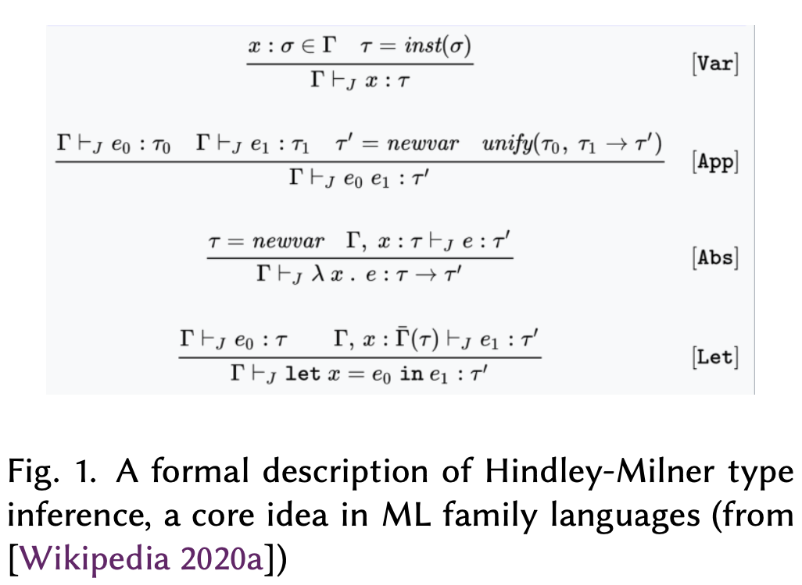

> 4 BACKGROUND: STRONGLY TYPED FUNCTIONAL PROGRAMMING THROUGH THE 1990S - CALCULI, MIRANDA, OCAML, HASKELL AND PIZZA

## 4 背景：90 年代的强类型函数式编程 - Calculi、Miranda、OCaml、Haskell 和 Pizza

> While Microsoft was establishing its monopoly position in the early 1990s, and object-orientation was sweeping the globe, the world of strongly typed functional programming was small and marginalized yet active and vibrant. This world overlapped with other fields of activity, which we would now call "PL research" but at the time included formal verification, type theory and programming logics and an increasing dose of category theory. This world was heavily influenced by foundational calculi, most obviously the Lambda Calculus and its variations such as System F, followed by concurrent calculi such as CCS and the Pi Calculus [Sangiorgi and Walker 2001]. Efforts to identify unifying object calculi were well underway [Abadi and Cardelli 1996] and workshops such as FOOL - Foundations of Object-Oriented Languages searched for foundational formalisms for new constructs being added to existing languages [Leavens 1995].

在微软于 90 年代初期确立垄断地位，面向对象横扫全球的同时，强类型函数式编程领域规模虽小且边缘化，但仍然活跃充满生机。这个领域与其他活动领域存在重叠，现在叫“编程语言研究”，当时这些领域包括形式化验证、类型理论、程序逻辑以及越来越多范畴论的应用。该领域深受基础演算的影响，最明显的是 Lambda 演算及其变体（例如System F），然后是并发演算（例如 CCS 和 Pi 演算） [Sangiorgi 和 Walker 2001]。确定统一的对象演算的工作也在进行中 [Abadi 和 Cardelli 1996]，诸如 FOOL（面向对象语言基础）之类的研讨会则致力于寻找用于现有语言中新增结构的基础形式化方法 [Leavens 1995]。

> "Formal methods" was an overlapping field in its hey-day in the 1980s, with major government initiatives in formalized hardware and software. Controversies [Restivo 2004] and the relatively modest successes of formal methods in industry saw researchers in the 1990s look to more pragmatic techniques for bug-finding including model checking and static analysis tools. Systems such as SMV, Z, ACL, HOL88, PVS, HOL90, Isabelle and commercial offerings were used to model, formalize and verify aspects of software and hardware designs. Functional languages were often used to implement and script these systems, e.g. Edinburgh ML (HOL88), Standard ML (HOL90, Isabelle), OCaml (Coq, NuPRL), Caml Light (HOL-Lite), LISP (ACL2, PVS). These systems thus formed a core constituency of adoption of strongly-typed functional languages and held functional programming close to more theoretical communities. The Formal Definition of Standard ML [Milner et al. 1990] and its commentary were seen by some as almost holy texts, enshrining the virtues of standardization, cooperation, formalism and theory. At the same time, some functional programming systems were closely aligned to research on parallel programming, e.g. Parallel ML [Rabhi and Gorlatch 2003] and parallel versions of Haskell. Together these formed the context in which I first encountered strongly typed functional programming and ML in my undergraduate research work [Syme 1993].

“形式化方法”是其在 80 年代鼎盛时期的一个重叠领域，政府在形式化硬件和软件方面投入了大量资金。由于争议 [Restivo 2004] 以及形式化方法在工业界取得的成功有限，90 年代的研究人员开始寻求更实用的找 bug 技术，包括模型检查和静态分析工具。诸如 SMV、Z、ACL、HOL88、PVS、HOL90、Isabelle 和商用产品等系统被用于建模、形式化和验证软件和硬件设计的各个方面。函数式语言通常用于实现和应用（script）这些系统，例如 Edinburgh ML (HOL88)、Standard ML (HOL90, Isabelle)、OCaml (Coq, NuPRL)、Caml Light (HOL-Lite)、LISP (ACL2, PVS)。因此，这些系统构成了应用强类型函数式语言的核心支持群体，也将函数式编程与更理论化的社区紧密联系在一起。标准 ML 的形式定义 [Milner 等人，1990 年] 及其评注被一些人视为几乎神圣的文本，颂扬着标准化、合作、形式主义和理论的优点。与此同时，一些函数式编程系统与并行编程研究密切相关，例如 Parallel ML [Rabhi 和 Gorlatch 2003] 和 Haskell 的并行版本。所有这些共同构成了我最初在大本科研究工作中关于强类型函数式编程和 ML 的背景 [Syme 1993]。

> The FDIV bug at Intel, discovered in 1994 [Athow 2014], led to a significant increase in formal verification investment on the part of hardware manufacturers. Intel turned to academia for help and among the projects brought in was Forte, led by Carl Seger, a toolchain using BDDs and theorem proving to verify the data paths of floating point circuits with respect to an IEEE model. The Forte toolchain was built around a strongly typed functional language called Forte FL. Although not otherwise influential on programming language design, this is mentioned because I was employed as an intern on this project in 1996-97 and in this context experienced the extreme effectiveness of strongly-typed FP as a "glue language" for symbolic manipulations in applied formal verification, an early application domain for F# [Seger et al. 2005]. Forte FL also made many pragmatic choices, for example when interoperating with external data and the inclusion of quotations in the design of a strongly-typed language. This experience had significant impact on the later design of F#.

1994 年在英特尔发现的 FDIV 错误 [Athow 2014] 导致硬件制造商对形式化验证的投入大幅增加。英特尔向学术界寻求帮助，其中引入的项目之一是 Forte，由 Carl Seger 领导，它是一个使用 BDD 和定理证明的工具链，用于根据 IEEE 模型验证浮点电路的数据路径。Forte 工具链围绕一种名为 Forte FL 的强类型函数式语言构建。虽然它对编程语言设计没有其他影响，但这里提一下是因为我曾在 1996-97 年担任该项目的实习生，并在此背景下体会到了强类型函数式编程作为应用形式化验证中符号操作的“胶水语言”的高效性，这也是 F# 的早期应用领域之一 [Seger 等人，2005]。Forte FL 还做出了许多务实的选择，例如与外部数据互操作时，在强类型语言设计中包含引用。这段经历对后来 F# 的设计产生了重大影响。

> Strongly-typed FP also saw significant use through Miranda, first released in 1985.[^8] During the 1990s the small world of strongly-typed functional programming also split and diverged in ways typical of active research communities. Haskell 98 united the streams of lazy, pure functional programming, precursors included HOPE and Miranda. Standard ML from 1989 remained the unifying effort for mixed functional-imperative languages. However, the INRIA Project Cristal group saw the standardization as premature, and instead created Caml Light and then OCaml [Leroy 2014]. Standard ML itself was heavily associated with its innovative module system and saw practical implementations in Poly ML, Standard ML of New Jersey and MLton.

强类型函数式编程也通过 1985 年首次发布的 Miranda 得到广泛应用 [^8]。在 90 年代，强类型函数式编程的世界虽小，却像活跃的研究社区那样存在分裂和分歧。Haskell 98 统一了惰性纯函数式编程流，其前身包括 HOPE 和 Miranda。1989 年的 Standard ML 仍然是函数式与命令式语言相混合。然而，INRIA Cristal 项目组认为标准化还为时过早，转而创建了 Caml Light，也就是后来 OCaml [Leroy 2014]。Standard ML 本身与其创新的模块系统密切相关，并在 Poly ML、New Jersey 标准 ML 和 MLton 中得以体现。

[^8]: > While the author hadn’t used Miranda, early adopters of F# (e.g. Ralf Herbrich) and internal supporters within Microsoft (e.g. Andrew Blake, head of MSR Cambridge 2008-2016) had positive exposure to Miranda during their education. Interestingly these people were outside the programming language theory or formal verification domain, active in machine learning and vision, and valued Miranda for its pragmatism and productivity.

    虽然作者没有使用过 Miranda，但 F# 的早期采用者（例如 Ralf Herbrich）和微软内部的支持者（例如 Andrew Blake，2008-2016 年微软剑桥研究院负责人）在他们的教育过程中都对 Miranda 持积极态度。有趣的是，这些人不在编程语言理论或形式化验证领域，他们活跃于机器学习和视觉领域，并珍视 Miranda 的实用性和生产力。

> Strongly-typed FP languages and compilers saw an ongoing trickle of interest, adoption and use. While not enough to challenge the massive adoption of C, C++ and Java, and largely unnoticed by industry, they were enough to sustain the languages, promote research and create small cohorts of dedicated advocates of OCaml, Standard ML and Haskell.[^9] People who had the good fortune to use these languages in practice (including myself) experienced dramatic increases in productivity as well as some frustrations. As with the original ML implementation, the domain of use was typically symbolic programming of some kind. The experience of productivity was due to the peculiar effectiveness of the combination of features on offer: the "magic" of Hindley-Milner type inference (Figure 1) to support safe, compositional programming; the effectiveness of parametric polymorphism (generics) and discriminated unions to describe and manipulate domain data; the correctness benefits of programming without pervasive null values; the close correspondence between code and formal models. These were in addition to the elegance and expressive power of expression-oriented programming, well-known from LISP but newly rediscovered with joy and delight by user after user. There was a strong feeling that these languages had the potential to be used much more broadly, and that valuable programming techniques were being lost through the widespread embrace of Java.   

工业界对强类型函数式编程语言和编译器的兴趣、采纳和应用一直都在，只是无法撼动 C、C++ 和 Java 被大规模采用的地位，连工业界大都未意识到这点。即便如此，这些语言也能维持下去，促进研究的同时，还出现了小批 OCaml、Standard ML 和 Haskell 的忠实拥护者 [^9]。那些有幸在实践中使用这些语言的人（包括我自己）都经历了生产力的显着提高，也伴随着一些挫败。与最初的 ML 实现一样，其应用领域大多还是某种符号编程。提高生产力的体验源于所提供的功能组合的独特效果：Hindley-Milner 类型推断 (图 1) 的“魔力”支持安全、可组合的编程；参数多态性（泛型）和判别联合的有效性可以描述和操纵域数据；规避了普遍空值，编程的正确性提高不少；代码和形式模型的关联紧密。此外，也尽显面向表达式编程的优雅和表达力，尽管这在 LISP 中早已闻名，却还是被用户一次又一次地欣喜地重新发现。这些语言本该被更普遍的应用，然而 Java 的流行使得这些宝贵的编程技巧正在不断的消失。

[^9]: > As a curious side note, one of those dedicated to OCaml was Julian Assange, later famous for WikiLeaks, see [Assange 2000].

    一个有趣的插曲是，OCaml 的忠实拥护者之一就是后来因 WikiLeaks 而闻名的朱利安·阿桑奇，参见 [Assange 2000]。

> The tidal wave of interest in object-orientation in the early 1990s had significant impact in academia, just as in industry. By the mid-1990s many in the world of FP and PL were genuinely shocked, bewildered, disoriented and in some cases disillusioned by the rise of C++, Java and OO in general. Reactions varied, and I now examine responses to the OO tidal wave that are key to understanding the genesis of F#, Scala and other languages in the 2000s.    

90 年代初期这股面向对象的风潮，如同工业界一样，在学术界也产生了重大影响。到 90 年代中期，FP 和 PL 领域中的许多人因 C++、Java 和面向对象 (OO) 的兴起而感到震惊、困惑、迷失方向，甚至在某些情况下感到幻灭。其中的反应各有不同，这些针对 OO 风潮的回应，我认为是理解像 F#、Scala 和其它 2000 年代语言诞生的关键。

> One response to object-orientation was to "give in" and work on Java implementations. Others worked on formalisms around Java, and indeed I initially did just that for my PhD thesis [Syme 1999a] and others formulated and published foundational object calculi. Some responded by integrating object-oriented features into FP languages: LISP had already added CLOS, the Common LISP object system and OCaml saw the introduction of new forms of genericity ("row polymorphism" and "column polymorphism") used as the basis for a fascinating object system [Garrigue 2001]. Around the same time the Standard ML designers and implementers started an initiative called ML2000, whose aim was to use formal, theoretically-founded approaches to build a language to rival object-orientation. This effort foundered and stopped in the late 1990s.

对面向对象的一种回应是“屈服”并致力于 Java 实现。一些人致力于 Java 的形式化，而我最初就是在我的博士论文中对此进行研究的 [Syme 1999a]，其他人则是在制定并发布基础对象演算。还有些人通过将面向对象特性集成到 FP 语言中来做出回应：LISP 已经添加了 CLOS（Common LISP 对象系统），OCaml 引入了新的泛型形式（“行多态性”和“列多态性”），用作“高级的”对象系统的基础 [Garrigue 2001]。大约在同一时间，Standard ML 的设计者和实现者启动了一个名为 ML2000 的计划，其目标是使用形式化、理论基础的方法来构建一种可以与面向对象竞争的语言。然而，这项工作在 90 年代后期陷入困境并停止。

> Another response was to propose to integrate specific technical features associated with strongly-typed functional languages into "mainstream" OO languages. Wadler and Odersky led the charge with the development of Pizza, a variation of Java that incorporated parametric polymorphism (generics), discriminated unions and first-class function values [Bracha et al. 1998]. This was subsequently trimmed-down to the proposal Generic Java (GJ), and later heavily influenced C#, Scala and F#. Ultimately GJ became the basis for Java generics, though its use of "erasure" and lack of accurate runtime type information were significant compromises.

另一种回应是提议将与强类型函数式语言相关的特定技术特性集成到“主流”面向对象语言中。Wadler 和 Odersky 领导开发了 Pizza，这是一种包含参数多态性（泛型）、判别联合和一等函数值的 Java 变体 [Bracha et al. 1998]。此后它被精简为 Generic Java (GJ) 提议，继而对 C#、Scala 和 F# 产生了重大影响。最终 GJ 成为 Java 泛型的基础，尽管它使用“擦除”并且缺乏准确的运行时类型信息是一个重大妥协。

> An alternative angle was to "deconstruct" functional programming itself and examine the underlying problems (as exhibited by implementations of Haskell or Standard ML for example). One instance of this was the paper Why no one uses functional languages [Wadler 1998]. This paper was central to my understanding of the programming language landscape as I started at Microsoft Research in 1998. Instead of blaming the unwashed masses for their ignorance, Wadler’s paper outlines seven problems of strongly-typed FP implementations at the time: Libraries, Portability, Availability, Packagability, Tools, Training, Popularity. It also listed Performance and Ignorance as non-reasons. The early development of F# was essentially an effort to address each of these.

另一种角度则是“解构”函数式编程本身并检查其潜在问题（例如 Haskell 或 Standard ML 的实现所展示的问题）。其中一个例子是论文“Why no one uses functional languages” [Wadler 1998]。这篇论文对我 1998 年加入微软研究院时理解编程语言格局至关重要。Wadler 的论文没有责怪普通大众的无知，而是概述了当时强类型 FP 实现的七个问题：库、可移植性、可用性、可打包性、工具、培训、流行度。它还将性能和无知列为非原因。F# 的早期开发本质上是解决这些问题的一种尝试。

> Further, some responded by trying to compete via new commercial implementations of strongly typed FP languages including Poly ML and Harlequin MLWorks. However, these saw little adoption and left the community with the feeling that the support of a "big player" in the industry was needed.

此外，一些人通过尝试新的强类型函数式语言的商业实现（例如 Poly ML 和 Harlequin MLWorks）来竞争。然而，这些语言的采用率很低，让社区有一种需要业界“大玩家”支持的感觉。

> A final response was to attempt to use the JVM as a substrate for implementing established functional programming languages, and thereby as a delivery vehicle for FP into the browser and the web (the nascent driving force behind Java at the time). Foremost in these efforts was MLj, a research/commercial implementation of Standard ML by Benton, Kennedy et al. at Persimmon [Benton and Kennedy 1999]. MLj was a whole-program compiler which allowed interop with the Java ecosystem through object programming extensions. When the research arm of Persimmon folded in 1998, Benton moved to MSR Cambridge, followed later by Kennedy, bringing experience highly relevant to .NET and later F#. Despite these various responses, there was also strong anathema to object-orientation in theoretical communities: proponents of OO were too readily labelled with the tar-brush of heresy: "unprincipled nonsense", "lacking theoretical foundations" and similar.

最后一种回应是尝试使用 JVM 作为实现既有函数式编程语言的底层架构，从而将函数式编程引入浏览器和网络（当时 Java 背后的新兴驱动力）。其中最突出的是 Persimmon 公司的 Benton、Kennedy 等人开发的 Standard ML 研究/商业实现 MLj [Benton 和 Kennedy 1999]。MLj 是一个全程序编译器，允许通过面向对象的扩展与 Java 生态系统互操作。当 Persimmon 的研究部门在 1998 年倒闭时，Benton 先于 Kennedy 来到微软研究院剑桥分部，带来了与 .NET 和后来的 F# 高度相关的经验。尽管有这些不同的回应，学术界对面向对象也存在强烈的厌恶情绪：面向对象的提倡者很容易被贴上“异端”的标签：“没有原则的废话”、“缺乏理论基础”等等。

> That completes our summary of the general surrounding context as I joined Microsoft Research in 1998 and began precursor work leading to F#. For completeness, the background influences I am aware of were as follows:

这部分总结了我 1998 年加入微软研究院并开始 F# 前期工作时的大致背景环境，为了完整起见，我所了解的背景影响如下：

> - I had used strongly typed functional programming, mostly in the context of theorem proving systems (Edinburgh ML in HOL88, Standard ML of New Jersey in HOL90, Caml-Light in HOL-Lite, ForteFL at Intel). I had come to love them, while appreciating their weaknesses. In my undergraduate work I had been supervised by one of the originators of ML, Malcolm Newey. Through my PhD work, the OCaml community and MSR Cambridge, I was involved in overlapping communities that saw strongly typed functional programming as the norm.

- 我使用过强类型函数式编程，主要用于定理证明系统 (Edinburgh ML in HOL88、Standard ML of New Jersey in HOL90、Caml-Light in HOL-Lite、英特尔的 ForteFL)。我开始喜爱它们，同时也认识到它们的弱点。在我的本科学习期间，我的导师之一是 ML 的创始人之一 Malcolm Newey。通过我的博士论文工作、OCaml 社区和微软研究院剑桥分部，我参与了将强类型函数式编程视为标准的重叠社区。

> - Ihadusedobject-orientedlanguages(C++,Java)including studying Java and the JVM formally as part of my thesis work. My experience with C++ at university in 1992 had been negative, particularly through the over-use of hierarchical classification in student projects - both as a modelling technique and its encoding in class hierarchies.

- 我使用过面向对象语言 (C++、Java)，包括在论文工作中正式学习 Java 和 JVM。我 1992 年在大学使用 C++ 的经历是负面的，特别是学生项目中过度使用层次分类作为建模技术及其在类层次结构中的编码。

> - As a child, from 1980-87, I had used BASIC and Logo (Apple II) and Turbo Pascal (Windows). As a student, I used Prolog, C, Scheme, Modula 2. A comparative programming languages course provoked interest in a range of languages. In early employment I had used Prolog on Windows for an Australian software company (SoftLaw, 1990-1993).

- 在 1980-1987 年间，我小时候使用过 BASIC 和 Logo (Apple II) 以及 Turbo Pascal (Windows)。作为学生，我使用过 Prolog、C、Scheme 和 Modula 2。一门比较编程语言的课程引起了我对各种语言的兴趣。在早期工作中，我曾在澳大利亚软件公司 (SoftLaw, 1990-1993) 为 Windows 使用过 Prolog。

> - I had implemented several strongly-typed language, proof and compilation systems as part of my PhD thesis work using various ML dialects and toolchains including SMLNJ, MoscowML, Caml-light and OCaml. Additionally, I had, somewhat unusually for the times, also implemented some visual tooling for these systems, notably a graphical proof editing IDE for HOL90 [Syme 1995] and a proof editing workbench for the theorem prover DECLARE [Syme 1999b]. I had a positive disposition to IDE tooling and understood the interaction between IDE tooling and language design.

- 在我的博士论文工作中，我使用过各种 ML 方言和工具链（包括 SMLNJ、MoscowML、Caml-light 和 OCaml）实现了几个强类型语言、证明和编译系统。此外，我还为这些系统实现了一些当时比较罕见的可视化工具，例如 HOL90 的图形化证明编辑 IDE [Syme 1995] 和定理证明器 DECLARE 的证明编辑工作台 [Syme 1999b]。我对 IDE 工具持积极态度，并理解 IDE 工具与语言设计之间的互动。

> - In 1996-98, I had been exposed to the work of academic leaders such as Drossopoulou, Leroy, Wadler and Odersky to synthesize OO and functional programming [Alves-Foss 1999].

- 在 1996-1998 年期间，我接触过 Drossopoulou、Leroy、Wadler 和 Odersky 等学术领袖的工作，他们试图将面向对象和函数式编程结合起来 [Alves-Foss 1999]。

> - I was part of discussions trying to reimagine how we deliver strongly-typed functional programming to "the masses".

- 我参与了讨论，试图重新设想如何将强类型函数式编程提供给“大众”。